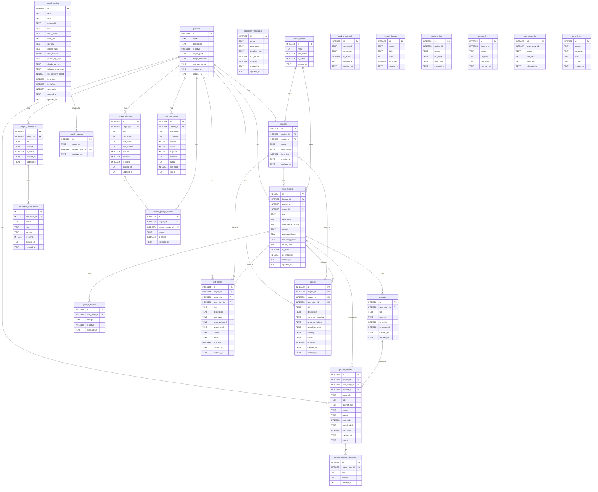

# Database Schema — sdlc.db

> **Engine:** SQLite via [better-sqlite3](https://github.com/WiseLibs/better-sqlite3)  
> **WAL mode:** enabled (`PRAGMA journal_mode = WAL`)  
> **Foreign keys:** enforced (`PRAGMA foreign_keys = ON`)  
> **Dev path:** `<project-root>/sdlc.db`  
> **Prod path:** `<userData>/sdlc.db`

---

## ER Diagram

---

## Table Reference

### `status_master` — Lookup / Master

Shared status list used by `features` and `user_stories`.

| Column | Type | Constraints | Notes |
|---|---|---|---|
| `id` | INTEGER | PK, AUTOINCREMENT | |
| `name` | TEXT | NOT NULL, UNIQUE | e.g. `Backlog`, `In Progress` |
| `sort_order` | INTEGER | NOT NULL, DEFAULT 0 | Display order |
| `is_active` | INTEGER | NOT NULL, DEFAULT 1 | Soft-delete flag |
| `created_at` | TEXT | NOT NULL, DEFAULT `datetime('now')` | ISO 8601 UTC |

**Seeded values (on first run):**

| sort_order | name |
|---|---|
| 1 | Backlog |
| 2 | In Progress |
| 3 | Implemented |
| 4 | In Review |
| 5 | Tested |
| 6 | Done |

---

### `projects` — Core

Top-level entity. Every other domain table cascades back to this.

| Column | Type | Constraints | Notes |
|---|---|---|---|
| `id` | INTEGER | PK, AUTOINCREMENT | |
| `name` | TEXT | NOT NULL | Display name |
| `description` | TEXT | | Optional free text |
| `is_active` | INTEGER | NOT NULL, DEFAULT 1 | Soft-delete flag |
| `project_path` | TEXT | | Absolute path to the project folder on disk |
| `design_template` | TEXT | | Default UI template identifier for screen designs |
| `last_opened_at` | TEXT | | Timestamp the project was last opened |
| `created_at` | TEXT | NOT NULL, DEFAULT `datetime('now')` | |
| `updated_at` | TEXT | NOT NULL, DEFAULT `datetime('now')` | |

**Triggers:** `trg_projects_insert`, `trg_projects_update`, `trg_projects_delete` → writes to `projects_log`.

---

### `features` — Core

Groups related user stories under a project.

| Column | Type | Constraints | Notes |
|---|---|---|---|
| `id` | INTEGER | PK, AUTOINCREMENT | |
| `project_id` | INTEGER | NOT NULL, FK → `projects(id)` ON DELETE CASCADE | |
| `status_id` | INTEGER | FK → `status_master(id)` | Nullable — no status if unset |
| `name` | TEXT | NOT NULL | |
| `description` | TEXT | | |
| `is_active` | INTEGER | NOT NULL, DEFAULT 1 | Soft-delete flag |
| `created_at` | TEXT | NOT NULL, DEFAULT `datetime('now')` | |
| `updated_at` | TEXT | NOT NULL, DEFAULT `datetime('now')` | |

**Triggers:** `trg_features_insert`, `trg_features_update`, `trg_features_delete` → writes to `features_log`.

---

### `user_stories` — Core

Individual stories within a feature. Central hub for prompts, test cases, and issues.

| Column | Type | Constraints | Notes |
|---|---|---|---|
| `id` | INTEGER | PK, AUTOINCREMENT | |
| `feature_id` | INTEGER | NOT NULL, FK → `features(id)` ON DELETE CASCADE | |
| `project_id` | INTEGER | NOT NULL, FK → `projects(id)` | Denormalized for fast project-level queries |
| `status_id` | INTEGER | FK → `status_master(id)` | |
| `title` | TEXT | NOT NULL | |
| `description` | TEXT | | |
| `acceptance_criteria` | TEXT | | Free-text or markdown |
| `priority` | TEXT | NOT NULL, DEFAULT `'medium'` | `low` / `medium` / `high` |
| `estimated_hours` | REAL | | Planning estimate |
| `remaining_hours` | REAL | | Remaining effort |
| `target_date` | TEXT | | ISO 8601 date string |
| `is_active` | INTEGER | NOT NULL, DEFAULT 1 | Soft-delete flag |
| `is_extracted` | INTEGER | NOT NULL, DEFAULT 0 | `1` = AI-extracted, not yet user-confirmed |
| `created_at` | TEXT | NOT NULL, DEFAULT `datetime('now')` | |
| `updated_at` | TEXT | NOT NULL, DEFAULT `datetime('now')` | |

**Triggers:** `trg_user_stories_insert`, `trg_user_stories_update`, `trg_user_stories_delete` → writes to `user_stories_log`.

---

### `prompts` — Prompts

Reusable AI prompts attached to a user story, optionally tagged (e.g. `backend`, `tests`).

| Column | Type | Constraints | Notes |
|---|---|---|---|
| `id` | INTEGER | PK, AUTOINCREMENT | |
| `user_story_id` | INTEGER | NOT NULL, FK → `user_stories(id)` ON DELETE CASCADE | |
| `tag` | TEXT | | Label for categorising the prompt |
| `prompt` | TEXT | NOT NULL, DEFAULT `''` | Prompt text |
| `is_active` | INTEGER | NOT NULL, DEFAULT 1 | Soft-delete flag |
| `is_executed` | INTEGER | NOT NULL, DEFAULT 0 | `1` = has been queued/run at least once |
| `created_at` | TEXT | NOT NULL, DEFAULT `datetime('now')` | |
| `updated_at` | TEXT | NOT NULL, DEFAULT `datetime('now')` | |

---

### `prompt_history` — Prompts

Immutable log of every prompt text that was executed for a user story.

| Column | Type | Constraints | Notes |
|---|---|---|---|
| `id` | INTEGER | PK, AUTOINCREMENT | |
| `user_story_id` | INTEGER | NOT NULL, FK → `user_stories(id)` ON DELETE CASCADE | |
| `prompt` | TEXT | NOT NULL | Snapshot of the prompt text at execution time |
| `is_active` | INTEGER | NOT NULL, DEFAULT 1 | |
| `executed_at` | TEXT | NOT NULL, DEFAULT `datetime('now')` | |

---

### `prompt_queue` — Prompts

Queue of prompts waiting to be executed or already run by an AI model.

| Column | Type | Constraints | Notes |
|---|---|---|---|
| `id` | INTEGER | PK, AUTOINCREMENT | |
| `project_id` | INTEGER | NOT NULL, FK → `projects(id)` ON DELETE CASCADE | |
| `user_story_id` | INTEGER | FK → `user_stories(id)` ON DELETE SET NULL | Nullable — survives story deletion |
| `prompt_id` | INTEGER | FK → `prompts(id)` ON DELETE SET NULL | Source prompt; nullable after deletion |
| `story_title` | TEXT | | Denormalized snapshot in case story is deleted |
| `tag` | TEXT | | Copied from source prompt |
| `prompt_text` | TEXT | NOT NULL | The actual text sent to the model |
| `status` | TEXT | NOT NULL, DEFAULT `'pending'` | `pending` / `running` / `done` / `error` |
| `output` | TEXT | | Raw model output |
| `exit_code` | INTEGER | | CLI exit code (0 = success) |
| `model_label` | TEXT | | Label of the model config used |
| `sort_order` | INTEGER | NOT NULL, DEFAULT 0 | Manual ordering within the queue |
| `created_at` | TEXT | NOT NULL, DEFAULT `datetime('now')` | |
| `ran_at` | TEXT | | Timestamp when execution completed |

---

### `prompt_queue_messages` — Prompts

Multi-turn conversation messages associated with a queue item (for chat-mode models).

| Column | Type | Constraints | Notes |
|---|---|---|---|
| `id` | INTEGER | PK, AUTOINCREMENT | |
| `queue_item_id` | INTEGER | NOT NULL, FK → `prompt_queue(id)` ON DELETE CASCADE | |
| `role` | TEXT | NOT NULL | `user` or `assistant` |
| `content` | TEXT | NOT NULL | Message body |
| `created_at` | TEXT | NOT NULL, DEFAULT `datetime('now')` | |

---

### `document_templates` — Documents

Built-in and user-defined markdown templates for new project documents.

| Column | Type | Constraints | Notes |
|---|---|---|---|
| `id` | INTEGER | PK, AUTOINCREMENT | |
| `name` | TEXT | NOT NULL, UNIQUE | Template display name |
| `description` | TEXT | | One-line description |
| `template_text` | TEXT | NOT NULL, DEFAULT `''` | Markdown content |
| `sort_order` | INTEGER | NOT NULL, DEFAULT 0 | |
| `is_active` | INTEGER | NOT NULL, DEFAULT 1 | |
| `created_at` | TEXT | NOT NULL, DEFAULT `datetime('now')` | |
| `updated_at` | TEXT | NOT NULL, DEFAULT `datetime('now')` | |

**Seeded templates (on first run):**

| sort_order | name |
|---|---|
| 1 | Empty Document |
| 2 | Project Overview |
| 3 | Technical Specification |
| 4 | Meeting Notes |
| 5 | Tasks |
| 6 | Release Notes |

---

### `project_documents` — Documents

Rich-text / markdown documents scoped to a project.

| Column | Type | Constraints | Notes |
|---|---|---|---|
| `id` | INTEGER | PK, AUTOINCREMENT | |
| `project_id` | INTEGER | NOT NULL, FK → `projects(id)` ON DELETE CASCADE | |
| `title` | TEXT | NOT NULL | |
| `content` | TEXT | | Markdown body |
| `is_active` | INTEGER | NOT NULL, DEFAULT 1 | Soft-delete flag |
| `created_at` | TEXT | NOT NULL, DEFAULT `datetime('now')` | |
| `updated_at` | TEXT | NOT NULL, DEFAULT `datetime('now')` | |

---

### `document_attachments` — Documents

Diagram or image attachments embedded in a project document.

| Column | Type | Constraints | Notes |
|---|---|---|---|
| `id` | INTEGER | PK, AUTOINCREMENT | |
| `document_id` | INTEGER | NOT NULL, FK → `project_documents(id)` ON DELETE CASCADE | |
| `name` | TEXT | NOT NULL | Attachment label |
| `type` | TEXT | NOT NULL, DEFAULT `'svg'` | `svg` or `drawio` |
| `content` | TEXT | NOT NULL, DEFAULT `''` | Raw SVG or draw.io XML |
| `is_active` | INTEGER | NOT NULL, DEFAULT 1 | |
| `created_at` | TEXT | NOT NULL, DEFAULT `datetime('now')` | |
| `updated_at` | TEXT | NOT NULL, DEFAULT `datetime('now')` | |

---

### `model_configs` — AI Models

Configuration for each AI model or CLI tool the app can invoke.

| Column | Type | Constraints | Notes |
|---|---|---|---|
| `id` | INTEGER | PK, AUTOINCREMENT | |
| `label` | TEXT | NOT NULL | Display name shown in the UI |
| `type` | TEXT | NOT NULL, DEFAULT `'cli'` | `cli` / `api` / `ollama` |
| `executable` | TEXT | | CLI binary name (`claude`, `gemini`, `mistral`) |
| `flags` | TEXT | | Extra CLI flags passed at invocation |
| `input_mode` | TEXT | NOT NULL, DEFAULT `'pipe'` | `pipe` or `heredoc` |
| `base_url` | TEXT | | API / Ollama base URL |
| `api_key` | TEXT | | Generic API auth key |
| `model_name` | TEXT | | Model identifier sent in API requests |
| `max_tokens` | INTEGER | | Optional token cap for API calls |
| `gemini_api_key` | TEXT | | Gemini-specific API key for devflow-agent fallback |
| `claude_api_key` | TEXT | | Claude-specific API key for devflow-agent fallback |
| `fallback_preference` | TEXT | DEFAULT `'auto'` | Fallback strategy: `auto` / `gemini` / `claude` |
| `use_devflow_agent` | INTEGER | NOT NULL, DEFAULT 0 | `1` = use the devflow agent wrapper |
| `is_active` | INTEGER | NOT NULL, DEFAULT 1 | |
| `is_default` | INTEGER | NOT NULL, DEFAULT 0 | Only one row should have `1` |
| `sort_order` | INTEGER | NOT NULL, DEFAULT 0 | UI ordering |
| `created_at` | TEXT | NOT NULL, DEFAULT `datetime('now')` | |
| `updated_at` | TEXT | NOT NULL, DEFAULT `datetime('now')` | |

**Seeded configs (on first run):**

| sort_order | label | type | executable | is_default |
|---|---|---|---|---|
| 0 | Claude CLI | cli | `claude` | ✅ |
| 1 | Gemini CLI | cli | `gemini` | |
| 2 | Mistral CLI | cli | `mistral` | |
| 3 | Ollama (phi4-mini) | ollama | — | |

---

### `model_mapping` — AI Models

Maps application pages/views to a specific model config, allowing per-page model overrides.

| Column | Type | Constraints | Notes |
|---|---|---|---|
| `id` | INTEGER | PK, AUTOINCREMENT | |
| `page_key` | TEXT | NOT NULL, UNIQUE | Identifier of the app page (e.g. `stories`, `screens`) |
| `model_config_id` | INTEGER | FK → `model_configs(id)` ON DELETE SET NULL | `NULL` = use the default model |
| `updated_at` | TEXT | NOT NULL, DEFAULT `datetime('now')` | |

---

### `screen_designs` — Screen Design

AI-generated or hand-crafted UI screen designs stored as HTML.

| Column | Type | Constraints | Notes |
|---|---|---|---|
| `id` | INTEGER | PK, AUTOINCREMENT | |
| `project_id` | INTEGER | NOT NULL, FK → `projects(id)` ON DELETE CASCADE | |
| `title` | TEXT | NOT NULL | |
| `description` | TEXT | | |
| `tech_stack` | TEXT | NOT NULL, DEFAULT `'html'` | e.g. `html`, `react`, `vue` |
| `html_content` | TEXT | NOT NULL, DEFAULT `''` | Raw HTML/CSS/JS of the design |
| `queued` | INTEGER | NOT NULL, DEFAULT `0` | Flagged for batch generation run |
| `executed` | INTEGER | NOT NULL, DEFAULT `0` | First generation has completed |
| `is_active` | INTEGER | NOT NULL, DEFAULT 1 | |
| `created_at` | TEXT | NOT NULL, DEFAULT `datetime('now')` | |
| `updated_at` | TEXT | NOT NULL, DEFAULT `datetime('now')` | |

---

### `screen_prompt_history` — Screen Design

Log of every prompt submitted in the screen design view.

| Column | Type | Constraints | Notes |
|---|---|---|---|
| `id` | INTEGER | PK, AUTOINCREMENT | |
| `project_id` | INTEGER | NOT NULL, FK → `projects(id)` ON DELETE CASCADE | |
| `screen_design_id` | INTEGER | FK → `screen_designs(id)` ON DELETE CASCADE | Nullable — row survives if design is deleted |
| `prompt` | TEXT | NOT NULL | |
| `is_active` | INTEGER | NOT NULL, DEFAULT 1 | |
| `executed_at` | TEXT | NOT NULL, DEFAULT `datetime('now')` | |

---

### `test_cases` — QA

Manual test cases that can be linked to a user story and/or feature.

| Column | Type | Constraints | Notes |
|---|---|---|---|
| `id` | INTEGER | PK, AUTOINCREMENT | |
| `project_id` | INTEGER | NOT NULL, FK → `projects(id)` ON DELETE CASCADE | |
| `feature_id` | INTEGER | FK → `features(id)` ON DELETE SET NULL | Optional link |
| `user_story_id` | INTEGER | FK → `user_stories(id)` ON DELETE SET NULL | Optional link |
| `title` | TEXT | NOT NULL | |
| `description` | TEXT | | |
| `test_steps` | TEXT | | Step-by-step instructions |
| `expected_result` | TEXT | | What should happen |
| `actual_result` | TEXT | | What actually happened (filled after execution) |
| `status` | TEXT | NOT NULL, DEFAULT `'not_run'` | `not_run` / `pass` / `fail` / `blocked` |
| `priority` | TEXT | NOT NULL, DEFAULT `'medium'` | `low` / `medium` / `high` |
| `is_active` | INTEGER | NOT NULL, DEFAULT 1 | |
| `created_at` | TEXT | NOT NULL, DEFAULT `datetime('now')` | |
| `updated_at` | TEXT | NOT NULL, DEFAULT `datetime('now')` | |

---

### `test_run_history` — QA

Records of automated test suite executions (e.g. Jest, Playwright runs).

| Column | Type | Constraints | Notes |
|---|---|---|---|
| `id` | INTEGER | PK, AUTOINCREMENT | |
| `project_id` | INTEGER | NOT NULL, FK → `projects(id)` ON DELETE CASCADE | |
| `framework` | TEXT | | e.g. `jest`, `playwright`, `vitest` |
| `command` | TEXT | NOT NULL | The exact command that was run |
| `passed` | INTEGER | | Count of passed tests |
| `failed` | INTEGER | | Count of failed tests |
| `skipped` | INTEGER | | Count of skipped tests |
| `duration` | TEXT | | Human-readable duration string |
| `output` | TEXT | | Full stdout/stderr output |
| `exit_code` | INTEGER | NOT NULL, DEFAULT 0 | `0` = all tests passed |
| `ran_at` | TEXT | NOT NULL, DEFAULT `datetime('now')` | |

---

### `issues` — Issues

Bug reports and issues linked to a project, feature, or user story.

| Column | Type | Constraints | Notes |
|---|---|---|---|
| `id` | INTEGER | PK, AUTOINCREMENT | |
| `project_id` | INTEGER | NOT NULL, FK → `projects(id)` ON DELETE CASCADE | |
| `feature_id` | INTEGER | FK → `features(id)` ON DELETE SET NULL | Optional link |
| `user_story_id` | INTEGER | FK → `user_stories(id)` ON DELETE SET NULL | Optional link |
| `title` | TEXT | NOT NULL | |
| `description` | TEXT | | |
| `steps_to_reproduce` | TEXT | | Numbered steps |
| `expected_behavior` | TEXT | | |
| `actual_behavior` | TEXT | | |
| `severity` | TEXT | NOT NULL, DEFAULT `'medium'` | `low` / `medium` / `high` / `critical` |
| `status` | TEXT | NOT NULL, DEFAULT `'open'` | `open` / `in_progress` / `resolved` / `closed` |
| `is_active` | INTEGER | NOT NULL, DEFAULT 1 | Soft-delete flag |
| `created_at` | TEXT | NOT NULL, DEFAULT `datetime('now')` | |
| `updated_at` | TEXT | NOT NULL, DEFAULT `datetime('now')` | |

---

### `quick_commands` — Utilities

Saved terminal commands accessible from the quick-launch panel.

| Column | Type | Constraints | Notes |
|---|---|---|---|
| `id` | INTEGER | PK, AUTOINCREMENT | |
| `command` | TEXT | NOT NULL | Shell command; use `{{input}}` for runtime substitution |
| `description` | TEXT | | Human-readable label |
| `is_active` | INTEGER | NOT NULL, DEFAULT 1 | |
| `created_at` | TEXT | NOT NULL, DEFAULT `datetime('now')` | |
| `updated_at` | TEXT | NOT NULL, DEFAULT `datetime('now')` | |

**Seeded commands (on first run, idempotent):**

| command | description |
|---|---|
| `git add -A; git commit -m "{{input}}"` | Commit the changes |
| `git push` | Push the changes to origin |
| `git status` | Show working tree status |
| `git log --oneline -10` | Last 10 commits (compact) |
| `git revert HEAD --no-edit` | Revert last commit (new commit) |
| `git revert {{input}} --no-edit` | Revert a specific commit hash |
| `git branch` | List local branches |
| `git branch -a` | List all branches (local + remote) |
| `git pull` | Pull from remote |
| `git remote -v` | Show remote URLs |

---

### `saved_themes` — UI

Global theme library (light/dark token sets) shared across all projects.

| Column | Type | Constraints | Notes |
|---|---|---|---|
| `id` | INTEGER | PK, AUTOINCREMENT | |
| `name` | TEXT | NOT NULL | Theme display name |
| `light` | TEXT | NOT NULL, DEFAULT `''` | JSON CSS variable map for light mode |
| `dark` | TEXT | NOT NULL, DEFAULT `''` | JSON CSS variable map for dark mode |
| `is_active` | INTEGER | NOT NULL, DEFAULT 1 | |
| `created_at` | TEXT | NOT NULL, DEFAULT `datetime('now')` | |

---

## Audit Log Tables

All three log tables share the same structure. They are written to by database triggers — never by application code directly.

### `projects_log`

| Column | Type | Notes |
|---|---|---|
| `id` | INTEGER PK | |
| `project_id` | INTEGER | ID of the affected project (not a FK — survives deletion) |
| `action` | TEXT | `INSERT` / `UPDATE` / `DELETE` |
| `old_data` | TEXT | JSON snapshot of row before change (`NULL` for INSERT) |
| `new_data` | TEXT | JSON snapshot of row after change (`NULL` for DELETE) |
| `changed_at` | TEXT | `datetime('now')` |

**Triggers:** `trg_projects_insert`, `trg_projects_update`, `trg_projects_delete`

### `features_log`

Same structure as `projects_log`, keyed by `feature_id`.  
**Triggers:** `trg_features_insert`, `trg_features_update`, `trg_features_delete`

### `user_stories_log`

Same structure as `projects_log`, keyed by `user_story_id`.  
**Triggers:** `trg_user_stories_insert`, `trg_user_stories_update`, `trg_user_stories_delete`

### `error_logs`

Runtime error sink written to by the main process error handler.

| Column | Type | Notes |
|---|---|---|
| `id` | INTEGER PK | |
| `source` | TEXT NOT NULL | Module or IPC handler that caught the error |
| `message` | TEXT NOT NULL | `error.message` |
| `stack` | TEXT | `error.stack` |
| `context` | TEXT | JSON of any extra context passed at the call site |
| `created_at` | TEXT | `datetime('now')` |

---

## Foreign Key Summary

| Child table | Foreign key | Parent table | On delete |
|---|---|---|---|
| `features` | `project_id` | `projects` | CASCADE |
| `user_stories` | `feature_id` | `features` | CASCADE |
| `user_stories` | `project_id` | `projects` | _(none)_ |
| `prompts` | `user_story_id` | `user_stories` | CASCADE |
| `prompt_history` | `user_story_id` | `user_stories` | CASCADE |
| `prompt_queue` | `project_id` | `projects` | CASCADE |
| `prompt_queue` | `user_story_id` | `user_stories` | SET NULL |
| `prompt_queue` | `prompt_id` | `prompts` | SET NULL |
| `prompt_queue_messages` | `queue_item_id` | `prompt_queue` | CASCADE |
| `project_documents` | `project_id` | `projects` | CASCADE |
| `document_attachments` | `document_id` | `project_documents` | CASCADE |
| `model_mapping` | `model_config_id` | `model_configs` | SET NULL |
| `screen_designs` | `project_id` | `projects` | CASCADE |
| `screen_prompt_history` | `project_id` | `projects` | CASCADE |
| `screen_prompt_history` | `screen_design_id` | `screen_designs` | CASCADE |
| `test_cases` | `project_id` | `projects` | CASCADE |
| `test_cases` | `feature_id` | `features` | SET NULL |
| `test_cases` | `user_story_id` | `user_stories` | SET NULL |
| `test_run_history` | `project_id` | `projects` | CASCADE |
| `issues` | `project_id` | `projects` | CASCADE |
| `issues` | `feature_id` | `features` | SET NULL |
| `issues` | `user_story_id` | `user_stories` | SET NULL |
